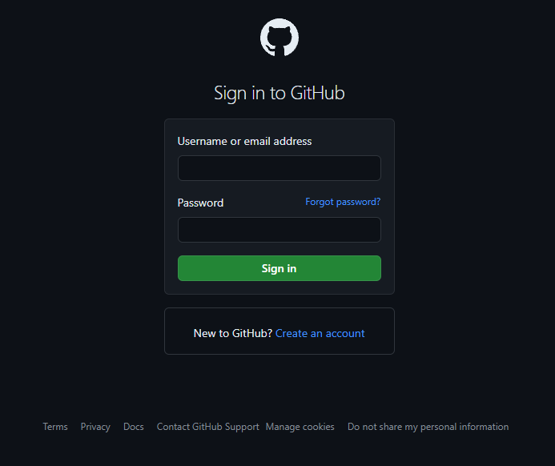

# Phishing Malware Scanner Project

## Description

This project, initially presented as a benign malware scanner for educational purposes within a school environment, serves as a phishing tool designed to illicitly obtain credentials from unsuspecting users. It integrates Evilginx links to mimic legitimate login pages for various platforms, including PayPal, GitHub, school accounts, and Instagram. The application provides a web interface built with Eel, enabling users to interact with it through a browser.

---

## Table of Contents

- [Installation](#installation)
  - [Requirements](#requirements)
  - [Installation Steps](#installation-steps)
- [Usage](#usage)
  - [Running the Application](#running-the-application)
  - [Accessing the GUI](#accessing-the-gui)
  - [Accessing the Phishing Pages](#accessing-the-phishing-sites)
- [Functionality](#functionality)
  - [Phishing Operation](#phishing-operation)
  - [Web Interface](#web-interface)
  - [Discord Interface](#using-discord-webhook)
- [Screenshots](#screenshots)
  - [Main Interface](#main-interface)
  - [Phishing Pages](#phishing-pages)
- [Folder Structure](#folder-structure)
- [Contributing](#contributing)
- [License](#license)
- [Acknowledgements](#acknowledgements)
- [Author](#author)

---

## Installation

### Requirements

- Python 3.x
- Evilginx (for phishing)
- Windows operating system (tested on Windows)

### Installation Steps

1. **Clone the repository:**

```bash
git clone https://github.com/sufianadnan/SenecaScanner.git
```

2. **Navigate to the project directory:**

```bash
cd SenecaScanner
```

3. **Install the required Python packages:**

```bash
pip install -r requirements.txt
```

4. **Install Evilginx:**
   - Evilginx is not included in this repository. You need to download and set it up separately.
   - Follow the instructions provided on the Evilginx GitHub repository: [https://github.com/kgretzky/evilginx2](https://github.com/kgretzky/evilginx2).
   - Set up Evilginx to handle phishing requests from the phishing pages generated by this project.

---

## Usage

### Running the Application

1. **Run the main script:**

```bash
python main.py
```

### Accessing the GUI

2. **Eel Based GUI**

An eel based GUI will pop up, user will be prompted to follow along, while in the background the network is being scanned. All information is sent to a discord webhook.

### Accessing the Phishing sites

The Phishing pages are the links created by evilginx. Links are removed in the Repo.

---

## Functionality

### Phishing Operation

- The application disguises itself as a malware scanner, presenting a benign interface to users.
- However, behind the scenes, it operates as a phishing tool to trick users into revealing their credentials.
- It targets multiple platforms, including PayPal, GitHub, school accounts, and Instagram, by mimicking their login pages.

### Web Interface

- The application provides a user-friendly web interface using Eel.
- Users are lured into interacting with the interface, believing it to be a legitimate malware scanner.
- However, the interface serves as a front for the phishing operation, collecting user credentials without their knowledge.

### Using Discord Webhook

- The application utilizes a Discord webhook to send information about the computer details and networking.
- Upon certain events or actions, such as completing a scan or gathering system information, the application sends a POST request to the specified Discord webhook URL.
- The payload sent to the webhook includes relevant details in a structured format, allowing users to receive notifications or logs of the application's activities on their Discord server or channel.
- This feature enhances monitoring and tracking capabilities, enabling users to stay informed about the operation of the phishing tool and any activities it performs on the compromised system.

---

## Screenshots

### Main Interface


### Phishing Pages

- GitHub Phishing Page



- School Account Phishing Page


- Instagram Phishing Page


---

## Folder Structure

```
- /web
  - additionalLogins.html     # Additional login options page
  - favicon.ico                # Website favicon
  - github_redirect.html      # GitHub redirect page
  - index.html                # Main HTML file (malware scanner interface)
  - instagram_retrieve.html  # Instagram redirect page
  - logininstructions.html   # Login instructions page
  - main.css                  # CSS stylesheets
  - paypal_retrieve.html     # PayPal redirect page
  - Prereq.html               # Prerequisites information page
  - redirect.html             # Redirect page
  - steps.html                # Steps information page
  - successful.html          # Successful Login  page - Used by flask server on EvilGinx Server
  - testpage.html             # Scanner page (placeholder)
- main.py              # Main Python script containing application logic
- requirements.txt            # List of Python dependencies
- README.md                   # This file
```

---

## Contributing

Contributions to this project are not encouraged, as it is intended for educational purposes within a controlled environment. Any misuse of this project for unethical purposes is strongly discouraged and may have legal consequences.

---

## License

This project is licensed under the [MIT License](LICENSE).

---

## Acknowledgements

- [Evilginx](https://github.com/kgretzky/evilginx2) - For providing the phishing capabilities.
- Other libraries and tools used in the project.

---

## Author

- Sufian Adnan
- GitHub: [Your GitHub Profile](https://github.com/sufianadnan)

---

_Note: This project is for educational purposes only and should not be used for any malicious activities. Any misuse of this project is the sole responsibility of the user._
